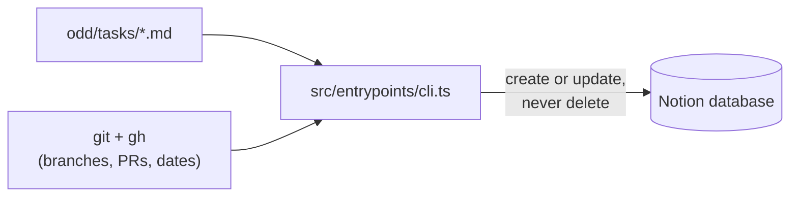

<h1 align="center">Notion Feature Board</h1>

<p align="center">
  A Notion board that keeps itself up to date from your repository's feature documents.
</p>

<p align="center">
  <a href="https://github.com/AlexMendizabal/Tablero-Automatico-Notion/actions/workflows/ci.yml"></a>
  <a href="LICENSE"></a>
  = 22">
  <a href="CONTRIBUTING.md"></a>
</p>

<p align="center">
  <a href="README.md">Español</a> · <strong>English</strong>
</p>

<p align="center"></p>

Syncs the status of a repository's features (ODD documents in
`odd/tasks/*.md`) into a Notion database, so you get a board that is always
up to date without maintaining it by hand.

> **Note on language:** the project was written in Spanish, but the board can
> be in **English or Spanish**. The `BOARD_LANGUAGE` variable (`es` by
> default, or `en`) picks the Notion property names, status values and row
> texts (see [Configuration](#configuration)). Feature documents accept both
> Spanish and English keywords at all times (`ramas` or `branches`,
> `## Tareas` or `## Tasks`). The script's console output stays in Spanish.

## How it works

1. **Markdown documents.** Each feature lives in `odd/tasks/<slug>.md`, with
   its task list as checkboxes and the patterns of the branches it uses.
2. **Sync.** The script reads every document, asks `git` and `gh` for
   branches, pull requests and dates, and computes one row per feature
   (status, progress, next pending task, days without activity).
3. **Notion board.** Each row is created or updated in the Notion database;
   nothing is ever deleted.



## What it does and why

Each `odd/tasks/<slug>.md` document describes a feature: its task list, its
branches and (optionally) its associated commits. The script reads all those
documents, computes one row per feature and syncs it (create or update, never
delete) against a Notion database.

Core ideas:

- **One row per feature, never by hand.** Status, progress, the next pending
  task, open PRs, live branches and days without activity are computed from
  the documents and from GitHub (`git` and `gh`). Those fields are not edited
  directly in Notion: the next run overwrites them.
- **Status is derived, never typed.** There is no column where someone writes
  "In progress" or "Done": it comes from the checked tasks and from whether
  there are open PRs, and nothing else (see
  [How the status is derived](#how-the-status-is-derived)).
- **The stalled view.** With "Days inactive" ("Días sin actividad") as a
  sortable column, the Notion database can be filtered or sorted to show
  first the features that have gone the longest without movement. Without
  that number, those features stay hidden among the rest.
- **Never deletes.** A Notion page whose slug no longer has a matching
  document is reported as an "orphan" in the output, but it is not removed:
  deleting is a human decision.

## Requirements

- Node.js 22 or later.
- `git`, with a full clone of the repository (`fetch-depth: 0` in CI): a
  shallow clone lacks the commit dates and the complete remote branches this
  script needs.
- The [`gh`](https://cli.github.com/) CLI, authenticated (`gh auth login`):
  the script reads the repository's pull requests with `gh pr list`, not
  through the GitHub API directly.

## Installation

Pick one of three ways to run the sync. All of them read the documents of
the repository they run in and need the [Notion database](#create-the-notion-database)
and the [variables](#configuration) described below.

### Option 1: GitHub Action (recommended)

Add a workflow to the repository that holds your documents. The action
installs and builds the sync, then runs it from your checkout:

```yaml
name: Notion board

on:
  push:
    branches: [main]
    paths: ['odd/tasks/**', 'odd/tareas/**']
  schedule:
    - cron: '0 11 * * *' # daily: "Days inactive" changes with time
  workflow_dispatch:

permissions:
  contents: read
  pull-requests: read

jobs:
  sync:
    runs-on: ubuntu-latest
    steps:
      - uses: actions/checkout@v7
        with:
          fetch-depth: 0 # required: anchors, branch dates and contributors need full history
          persist-credentials: false
      - uses: AlexMendizabal/Tablero-Automatico-Notion@v2
        with:
          notion-token: ${{ secrets.NOTION_TOKEN }}
          notion-database-id: ${{ secrets.NOTION_TABLERO_DB_ID }}
          notion-tasks-database-id: ${{ secrets.NOTION_TAREAS_DB_ID }} # optional
          board-language: en # optional, default es
```

Inputs: `notion-token` and `notion-database-id` (required for a real
sync; without them a run without `dry-run` fails with a clear error);
`notion-tasks-database-id`, `board-language`, `dry-run` (`true` never writes
to Notion; useful on `pull_request` to validate documents without secrets),
`features-folder`, `tasks-folder` and `base-branch` (optional; they map to
`TABLERO_CARPETA`, `TABLERO_CARPETA_TAREAS` and `TABLERO_RAMA_BASE`, and are
only set when non-empty). The action passes the workflow's `github.token` to
`gh`, so the job needs `pull-requests: read`. The checkout **must** use
`fetch-depth: 0`.

> The action runs `actions/setup-node` (Node 22) inside the calling job,
> which changes `node` on the `PATH` for every later step of that job. Run it
> in its own job (as above), or after any steps that need another Node
> version.

### Option 2: npm / npx

The package is `tablero-automatico-notion`; its command is `tablero-notion`.
From the root of your repository:

```bash
npx tablero-automatico-notion --dry-run   # one-off run, nothing written to Notion
```

Or install it as a dev dependency and call the command by its name:

```bash
npm install --save-dev tablero-automatico-notion
npx tablero-notion --dry-run
npx tablero-notion            # real sync
```

It reads `.env` from the current directory, so run it from the repository
root. `git` and an authenticated `gh` must be on the `PATH`.

### Option 3: from a clone of this repository

```bash
npm ci
npm run sync:dry
```

### Advanced tasks in short

Tasks are optional. To sync them: write task documents in `odd/tareas/`
(same format plus `feature: "<feature-slug>"`), create a second Notion
database with the [task columns](#advanced-tasks-optional), share it with the
integration and set `NOTION_TAREAS_DB_ID` (the `notion-tasks-database-id`
input in the action). Without it, tasks are still validated but not written.

## Create the Notion database

1. Go to <https://www.notion.so/developers> and create an **internal
   integration** for the workspace, with the **read, update and insert
   content** capabilities. Without all three, the script cannot read the
   schema, create pages or update them.
2. Create a new database of type **"Table - full page"**.
3. Add these 11 properties with these **exact names and types**, using the
   column that matches `BOARD_LANGUAGE` (Spanish names for `es`, the default;
   English names for `en`). The script looks the names up literally (Notion
   is case- and accent-sensitive; a name that does not match is reported as a
   missing property):

   | Spanish name (`es`) | English name (`en`) | Type | Meaning |
   |---|---|---|---|
   | Feature | Feature | Title | Feature title |
   | Slug | Slug | Text (rich text) | Document file name |
   | Estado | Status | Select | Derived status |
   | Progreso | Progress | Text (rich text) | Progress, e.g. `2/3 tareas` / `2/3 tasks` |
   | Pendiente | Pending | Text (rich text) | Next pending task |
   | PRs abiertos | Open PRs | Text (rich text) | Open PRs |
   | Ramas | Branches | Text (rich text) | Live branches |
   | Días sin actividad | Days inactive | Number | Days without activity |
   | Actualizado | Updated | Date | Last updated |
   | Documento | Document | URL | Link to the document |
   | Huella | Fingerprint | Text (rich text) | Fingerprint of the task list |

   Optionally, one more column (see [Contributors](#contributors)):

   | Spanish name (`es`) | English name (`en`) | Type | Meaning |
   |---|---|---|---|
   | Contribuyentes | Contributors | Multi-select | Who worked on the feature, according to git and GitHub |

   If the database does not have it, the sync does not write it and prints a
   single informational line (`La base de Features no tiene la columna
   "Contributors": se omite.`); the exit code does not change. If it exists
   with another type, it is a schema error.

   If any of these columns is renamed or changes type in Notion, the
   `TEXTOS_POR_IDIOMA` dictionary (names) or `TIPOS_PROPIEDAD` (types), both
   in `src/core/entities/feature.ts`, must be updated too.
   The two sides of the contract live there and in Notion, and neither can be
   discovered from the other automatically.
4. Share the database with the integration: open the database, open the
   `•••` menu in the top-right corner → **Connections** → find and add the
   integration created in step 1. Without this step, every call from the
   script returns a permissions error even if the token is valid.
5. Get the database ID from its URL. When you open the database in the
   browser, the URL looks roughly like this:

   ```
   https://www.notion.so/myworkspace/Tablero-de-features-a1b2c3d4e5f67890a1b2c3d4e5f67890?v=...
   ```

   The ID is the **32 hexadecimal characters** right before the `?` (in the
   example, `a1b2c3d4e5f67890a1b2c3d4e5f67890`). You can also paste the full
   URL as is: `normalizarIdBaseNotion` recognizes it and drops the `?v=...`,
   which identifies the VIEW, not the database. The **"Copy data source ID"**
   option in Notion's menu does **not** work: that ID belongs to a different
   API object (the "data source", a layer Notion added inside each database
   in 2025) and is not what this script expects in `NOTION_TABLERO_DB_ID`.

## Configuration

Copy `.env.example` to `.env` and fill in the two required variables:

```bash
NOTION_TOKEN=secret_...
NOTION_TABLERO_DB_ID=a1b2c3d4e5f67890a1b2c3d4e5f67890
```

Optional variables, with their default value in parentheses:

- `BOARD_LANGUAGE` (`es`): language of the Notion board — property names,
  status values and row texts. `es` for Spanish, `en` for English; unset or
  empty means `es`. Any other value stops the run with a clear error and a
  non-zero exit code. It does not affect how documents are read: both
  languages' keywords are always accepted. Switching an existing board to
  another language also means renaming its Notion columns (see the table
  above).
- `TABLERO_CARPETA` (`odd/tasks`): folder where the documents live, relative
  to the repository root.
- `TABLERO_RAMA_BASE` (`main`): base branch used to build the link in each
  row's "Documento" ("Document") property, and the branch that branches are
  compared against to compute [contributors](#contributors).
- `NOTION_TAREAS_DB_ID` (unset): ID (or full URL) of the Notion database for
  advanced tasks (see [Advanced tasks](#advanced-tasks-optional)). Unset
  means tasks are not written to Notion.
- `TABLERO_CARPETA_TAREAS` (`odd/tareas`): folder where the task documents
  live, relative to the repository root. If set, it cannot be empty or the
  same folder as `TABLERO_CARPETA`: in those cases the run stops with a
  configuration error before calling Notion. If unset and `TABLERO_CARPETA`
  is `odd/tareas`, tasks are disabled and only features are synced.

## Usage

**`npm run sync:dry` without credentials** (no `.env`, or an incomplete one):
no network calls are made to Notion, nor to GitHub beyond the `git`/`gh`
calls needed to compute the rows. For each valid document it prints the row
that would be computed (slug, status, progress, open PRs, days without
activity, update date) and ends with `Errores de formato: N` (format errors).
This is the mode used by the pull request validation job: it never prints
Notion counters ("Creadas:", "Actualizaría:", etc.), because those numbers
were not computed.

**`npm run sync:dry` with credentials**: on top of the above, it queries
Notion read-only (schema, existing pages) and shows the full plan — how many
pages it would create, how many it would update, how many would get their
body rewritten, and which would be orphaned — without writing anything yet.

**`npm run sync`**: runs the real sync against Notion. It exits with a
non-zero code if any document had a format error or any slug is duplicated
in Notion, even if the rest of the features synced without problems.

## Automation

> In this template repository the workflow is **disabled**, so it does not
> show up red without credentials. When adopting it, enable it in the
> Actions tab after adding the two secrets.

The `.github/workflows/sync-tablero-notion.yml` workflow runs on four
triggers:

1. **`push`** to the base branch, when something relevant changes (a
   document in `odd/tasks/` or `odd/tareas/`, the script itself, the workflow, or
   `package.json`/`package-lock.json`): performs the real sync.
2. **`pull_request`** on those same paths: only validates the documents'
   format (`sync:dry`, without credentials), so a PR fails before merge if a
   document is malformed.
3. **`schedule`** (daily cron): a push alone is not enough to keep the board
   current, because "Days inactive" changes with the mere passage of
   time and merging a PR does not always touch a document. Without this daily
   run, the board freezes between edits.
4. **`workflow_dispatch`**: to force a manual run.

It needs two secrets configured in the repository (**Settings → Secrets and
variables → Actions**): `NOTION_TOKEN` and `NOTION_TABLERO_DB_ID` (plus the optional
`NOTION_TAREAS_DB_ID` for tasks). If the first two
are missing, the sync job stops within seconds with an explicit error, before
installing anything, and never reports a success that did not actually write
anything.

For an English board, add a repository **variable** (not a secret)
`BOARD_LANGUAGE` with value `en` in the same settings page, under the
**Variables** tab. If it is not defined, the workflow uses `es`.

Separately, the `.github/workflows/ci.yml` workflow runs `npm run typecheck`,
`npm run build` and `npm test` on every push to `main` and every pull request. It needs no
credentials.

## Document format contract

Each document lives at `<TABLERO_CARPETA>/<slug>.md` and has this minimal
shape:

```markdown
---
ramas: ["docs/odd-<slug>", "feat/<slug>*"]
---

# Human-readable feature title

## Tareas

- [ ] **T1 — Short name**: description.
- [ ] **QA1 — Manual test**: description.
```

The same document with the English keywords, accepted equally (whatever the
value of `BOARD_LANGUAGE`):

```markdown
---
branches: ["docs/odd-<slug>", "feat/<slug>*"]
---

# Human-readable feature title

## Tasks

- [ ] **T1 — Short name**: description.
- [ ] **QA1 — Manual test**: description.
```

Rules:

- **`ramas`** or **`branches`** (required, in the frontmatter): JSON array of
  glob patterns (only `*` as wildcard) that must cover every branch the
  feature uses. A branch that matches no pattern does not count towards the
  branches, open PRs or activity date columns. Use only one of the two
  spellings: having both in the same document is a duplicate-key format
  error.
- **`commits`** (optional): JSON array of **full** commit hashes (40
  lowercase hexadecimal characters) made directly on the base branch, with no
  PR or branch of their own. They act as activity anchors for that kind of
  work, which would otherwise have no associated date. They also cover a
  squash-merged PR: the hash of the squash commit on the base branch keeps
  its authors and co-authors as [contributors](#contributors). Requires a
  full clone of the repository (without `fetch-depth: 0` it is reported as an
  environment error).
- **A single `## Tareas` or `## Tasks` section**: any other level-2 heading
  closes the section. Having zero, or more than one, task section (including
  one of each spelling) is a format error.
- **IDs `T1`, `T2`, ... for work, `QA1`, `QA2`, ... for manual tests**: the
  `QA` prefix is the only thing that distinguishes a task from a manual test
  when deriving the status. The ID goes in bold at the start of the checkbox,
  separated from the name by an em dash (`—`, not a regular hyphen); the
  description after the colon is optional.
- **Code blocks are ignored**: a ` ```markdown ` block containing an example
  frontmatter or task section does not count as the document's real
  frontmatter or section.

A complete example, with one task done, one pending and one pending manual
test, lives in [`odd/tasks/ejemplo-feature.md`](odd/tasks/ejemplo-feature.md)
(written with the Spanish keywords; `branches` and `## Tasks` work the same).

## Advanced tasks (optional)

Besides features, the sync can track **advanced tasks**: pieces of work born
in the repository, each with its own document, optionally attached to a
parent feature. They are synced after the features, into a database of their
own.

1. **Documents**: `<TABLERO_CARPETA_TAREAS>/<slug>.md` (default
   `odd/tareas/`), with the same format as a feature document plus an
   optional `feature` key in the frontmatter: the slug of the parent feature,
   as a JSON string.

   ```markdown
   ---
   ramas: ["feat/<slug>*"]
   feature: "<feature-slug>"
   ---

   # Human-readable task title

   ## Tareas

   - [ ] **T1 — Short name**: description.
   ```

   `feature` must be a JSON string holding a valid document slug (the file
   name without `.md`, e.g. `feature: "mi feature"` for `mi feature.md`).
   Inner spaces and dots are allowed; it is rejected if it is empty, has
   leading or trailing whitespace, is exactly `.` or `..`, or contains `/`,
   `\`, `< > : " | ? *` or control characters. A rejected value is a format
   error of that task. If `feature` names a slug with no document in
   `TABLERO_CARPETA`, the run prints a warning ("Avisos") in the tasks
   summary; it is not a format error and does not change the exit code.
   Example:
   [`odd/tareas/ejemplo-tarea.md`](odd/tareas/ejemplo-tarea.md).
2. **Notion database**: create a second database with the **same columns as
   the board** (see [Create the Notion database](#create-the-notion-database)),
   except the title column, which is called **`Tarea`** (`es`) or **`Task`**
   (`en`) instead of `Feature`, plus two columns of its own:

   | Name (`es`) | Name (`en`) | Notion type | Content |
   |---|---|---|---|
   | Feature | Feature | Relation (to the Features database) | Page of the parent feature; empty when the task has no parent |
   | Responsable | Assignee | Person | Assigned by hand in Notion; the sync **never** writes or overwrites it |

   Share it with the same integration. The sync validates both columns: that
   they exist with their type, and that the `Feature` relation targets the
   Features database (`NOTION_TABLERO_DB_ID`); a relation to another database
   is a schema error. The optional `Contribuyentes` (`Contributors`,
   multi-select) column works as on the board: if it is missing, it is
   skipped with an informational line.
3. **Configuration**: set `NOTION_TAREAS_DB_ID` to its ID or URL (same rules as
   `NOTION_TABLERO_DB_ID`). It uses the same `NOTION_TOKEN`.

Behavior:

- No task folder, or no `.md` in it: tasks do nothing and the output is the
  same as before.
- Task documents but no `NOTION_TAREAS_DB_ID`: features are synced as usual
  and tasks are not written to Notion (with an informational line), but their
  documents are still validated: a format error makes the exit code non-zero
  and parent feature warnings are printed.
- `Feature` relation: each task points to its parent feature's page in the
  Features database (the one that already existed or was just created). If
  the parent has no page (for example, because its document has a format
  error), the relation is left empty and a warning is printed.
- If the Features sync did not finish (environment, configuration or schema
  error), tasks are not written to Notion, with an informational line, so
  relations are never cleared on partial information; the exit code reflects
  the Features error.
- `--dry-run` without credentials: after the feature rows, a second block
  labeled `Tareas:` lists the task rows, including the parent feature slug.
- `--dry-run` with credentials: the tasks plan shows, per task, which
  Features page its relation would point to.
- Any error in either entity (format, schema, invalid ID) makes the exit code
  non-zero.

## How the status is derived

The status property ("Status" / "Estado") takes one of four values, written
in the board's language, in this order of precedence:

| English (`en`) | Spanish (`es`) | When |
|---|---|---|
| **Done** | **Terminada** | There is at least one task, all of them are checked as done, and there is no open PR on the feature's branches. |
| **QA pending** | **QA pendiente** | There are unfinished tasks, and all of them are QA tasks (`QA` prefix). |
| **Not started** | **Sin empezar** | No task is checked as done. |
| **In progress** | **En curso** | Any other combination (for example, with tasks done and non-QA tasks pending, or with everything done but a PR still open). |

The "Updated" ("Actualizado") date — and from it "Days inactive" ("Días sin
actividad") —
takes the most recent of: the commit of each live branch matching the
patterns, the moment each related PR was merged or closed (or opened, if it
is still open), and the date of each anchor commit declared in `commits`.
Without any of those, it falls back to the date of the document itself and,
if that does not exist either, to the date of the run.

**GitHub's `updatedAt` for a pull request is never used.** That field moves
with events that are not real work on the feature — for example, cleaning up
an old branch updates a PR merged weeks earlier — and using it would hide
genuinely stalled features behind a recent date that means nothing.

## Contributors

The optional "Contribuyentes" ("Contributors", multi-select) column of both
Features and Tasks lists who worked on each document. It only uses what the
document already declares:

- **Commits on its branches**: those on each branch (local or `origin/`)
  matching its `ramas` patterns that are **not** on the base branch. The base
  branch is `origin/<TABLERO_RAMA_BASE>` if it exists, otherwise the local
  `<TABLERO_RAMA_BASE>` branch; if neither exists, branch commits are skipped
  with a warning (not an error).
- **Anchor commits** (`commits` in the frontmatter): their authors. This is
  how the authors of a squash-merged PR are kept, since its original commits
  are no longer on any branch.
- **Authors of the PRs** whose branches match `ramas` (the GitHub login
  reported by `gh pr list`).
- **Commits of its merged PRs**: the authors (and co-authors) of every commit
  of each merged PR whose branch matches `ramas`, according to GitHub
  (`gh pr view <number> --json commits`). This way a merge without squash
  does not lose the people who worked on the branch. It costs one `gh` call
  per merged PR per run (shared by Features and Tasks).
- **`Co-authored-by: Name <email>` trailers** of those commits.

Each person appears once, with their **GitHub login** when it is known (PR
author, or a noreply email such as `123+login@users.noreply.github.com`) and
otherwise with their git **author name**. Deduplication is case-insensitive
and the order is alphabetical. Bots are excluded (`[bot]`, `dependabot`,
GitHub apps, and GitHub web-flow commits, `noreply@github.com`). Since Notion
does not allow commas in a multi-select option, they are replaced by a space,
and each value is cut to 100 characters. The value is written on create and
on every update (an empty list if there is nobody). `--dry-run` without
credentials shows it as the last column of each row (`—` if there is nobody).

If git or gh fail to read any of those sources for a document (for example,
a transient `gh pr view` error), its contributors are **unknown**: that page
does not get the column (it keeps the contributors it already had in Notion;
its other properties are still updated), `--dry-run` shows `?`, and one
warning per entity lists the affected slugs. The exit code does not change.

Tip: if the same person shows up under two names (or as a name and as a
login), unify them with a [`.mailmap`](https://git-scm.com/docs/gitmailmap)
file at the repository root; git applies it to the author name and email the
sync reads. For example, to make the author name match the login:

```
ana-gh <ana@example.com>
ana-gh <ana@example.com> Ana Pérez <ana@personal.com>
```

(the first line renames commits made with `ana@example.com`; the second
renames and re-emails those made as `Ana Pérez <ana@personal.com>`).

## Agent skill

The package ships an agent skill at `skill/SKILL.md` (also in this
repository) that teaches an AI coding agent the document contract: where
feature and task documents live, the frontmatter rules, the task line
format, how status and contributors are derived, and how to validate with
`--dry-run`. Copy the `skill/` folder into your agent's skills directory
(for example `.claude/skills/tablero-odd-documents/` or
`~/.claude/skills/tablero-odd-documents/`), or point the agent at the file
from `node_modules/tablero-automatico-notion/skill/SKILL.md`.

## Upgrading from v1

- **Script path**: the single `src/sync-tablero-features.ts` script is now
  `src/entrypoints/cli.ts`. `npm run sync` and `npm run sync:dry` still work;
  update any workflow or script that called the old file directly, or switch
  to the [GitHub Action](#option-1-github-action-recommended) or the
  `tablero-notion` command.
- **New optional columns**: `Contribuyentes` (`Contributors`) on the
  Features database (multi-select). Without it the sync prints one
  informational line and skips it (and does not read its sources); existing
  boards keep working unchanged.
- **New optional database**: Tasks, with `Feature` (relation),
  `Responsable` (`Assignee`, person) and `Contribuyentes` (see
  [Advanced tasks](#advanced-tasks-optional)).
- **New environment variables**: `NOTION_TAREAS_DB_ID` and
  `TABLERO_CARPETA_TAREAS` (both optional). An explicitly empty
  `TABLERO_CARPETA_TAREAS`, or one equal to `TABLERO_CARPETA`, is a
  configuration error.
- **Workflow**: add `odd/tareas/**` to its `paths` filters and, if you use
  tasks, pass `NOTION_TAREAS_DB_ID` as a secret.

## Known limitations

- It only sees what reached GitHub: a local commit that was not pushed, or a
  branch that only lives on one machine, are invisible to this script.
- A failure halfway through rewriting a page body can leave duplicated tasks
  until the next run, which detects the mismatch (through the "Fingerprint" /
  "Huella" property) and repairs the whole page.
- Orphan rows (Notion pages whose slug no longer has a document) are reported
  in the output, but never deleted automatically.

## Contributing

Issues and pull requests are welcome, in English or Spanish. See
[`CONTRIBUTING.md`](CONTRIBUTING.md) for setup, tests and the pull request
flow. To report a security issue, see [`SECURITY.md`](SECURITY.md). Released
changes are listed in [`CHANGELOG.md`](CHANGELOG.md).

## License

MIT. See [`LICENSE`](LICENSE).
