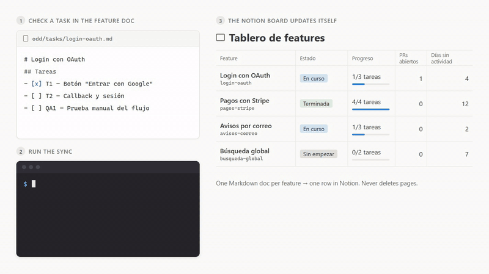
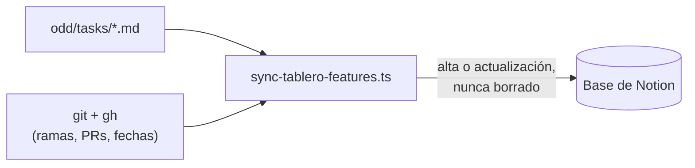

<h1 align="center">Tablero de features en Notion</h1>

<p align="center">
  Un tablero de Notion que se mantiene solo, a partir de los documentos de features del repositorio.
</p>

<p align="center">
  <a href="https://github.com/AlexMendizabal/Tablero-Automatico-Notion/actions/workflows/ci.yml"></a>
  <a href="LICENSE"></a>
  = 22">
  <a href="CONTRIBUTING.md"></a>
</p>

<p align="center">
  <a href="README.md">English</a> · <strong>Español</strong>
</p>

<p align="center"></p>

Sincroniza el estado de las features de un repositorio (documentos ODD en
`odd/tasks/*.md`) hacia una base de datos de Notion, para tener un tablero
siempre actualizado sin mantenerlo a mano.

> **Idioma:** el tablero puede estar en **español o en inglés**. La variable
> `BOARD_LANGUAGE` (`es` por defecto, o `en`) define los nombres de las
> propiedades de Notion, los valores de estado y los textos de las filas (ver
> [Configuración](#configuración)). Los documentos de features aceptan
> siempre las palabras clave en los dos idiomas (`ramas` o `branches`,
> `## Tareas` o `## Tasks`). La salida por consola del script sigue en
> español.

## Cómo funciona

1. **Documentos Markdown.** Cada feature vive en `odd/tasks/<slug>.md`, con
   su lista de tareas como checkboxes y los patrones de las ramas que usa.
2. **Sincronización.** El script lee todos los documentos, consulta `git` y
   `gh` para obtener ramas, pull requests y fechas, y calcula una fila por
   feature (estado, progreso, pendiente, días sin actividad).
3. **Tablero en Notion.** Cada fila se crea o se actualiza en la base de
   Notion; nunca se borra nada.



## Qué hace y por qué

Cada documento `odd/tasks/<slug>.md` describe una feature: su lista de
tareas, las ramas y (opcionalmente) los commits asociados. Este script lee
todos esos documentos, calcula una fila por feature y la sincroniza (alta o
actualización, nunca borrado) contra una base de Notion.

Ideas centrales:

- **Una fila por feature, nunca a mano.** El estado, el progreso, la tarea
  pendiente, los PRs abiertos, las ramas vivas y los días sin actividad se
  calculan a partir de los documentos y de GitHub (`git` y `gh`). Esos campos
  no se editan directamente en Notion: la corrida siguiente los pisa.
- **El estado se deriva, nunca se escribe a mano.** No hay una columna donde
  se escriba "En curso" o "Terminada": sale de las tareas marcadas, de si
  quedan PRs abiertos, y de nada más (ver más abajo "Cómo se deriva el
  estado").
- **La vista de estancadas.** Con "Días sin actividad" como columna
  ordenable, la base de Notion se puede filtrar u ordenar para ver primero
  las features que llevan más tiempo sin movimiento. Sin ese número, esas
  features quedan escondidas entre las demás.
- **Nunca borra.** Una página de Notion cuyo slug ya no tiene documento
  correspondiente se informa como "huérfana" en la salida, pero no se
  elimina: borrar es una decisión humana.

## Requisitos

- Node.js 22 o superior.
- `git`, con el repositorio clonado completo (`fetch-depth: 0` en CI): un
  clon superficial no tiene las fechas de commit ni las ramas remotas
  completas que este script necesita.
- El CLI [`gh`](https://cli.github.com/) autenticado (`gh auth login`): el
  script lee los pull requests del repositorio con `gh pr list`, no con la
  API de GitHub directamente.

## Instalación

```bash
npm ci
```

## Crear la base en Notion

1. Ingresar a <https://www.notion.so/developers> y crear una **integración
   interna** para el workspace, con capacidades de **lectura, actualización
   e inserción de contenido**. Sin esas tres, el script no puede leer el
   esquema, ni crear páginas, ni actualizarlas.
2. Crear una base de datos nueva con el tipo **"Tabla - página completa"**
   ("Table - full page").
3. Agregar estas 11 propiedades, con este **nombre y tipo exactos**, usando
   la columna que corresponde a `BOARD_LANGUAGE` (nombres en español para
   `es`, el valor por defecto; nombres en inglés para `en`). Notion distingue
   mayúsculas, minúsculas y tildes; un nombre que no coincida se reporta como
   propiedad faltante:

   | Nombre en español (`es`) | Nombre en inglés (`en`) | Tipo | Significado |
   |---|---|---|---|
   | Feature | Feature | Title | Título de la feature |
   | Slug | Slug | Text (rich text) | Nombre del archivo del documento |
   | Estado | Status | Select | Estado derivado |
   | Progreso | Progress | Text (rich text) | Progreso, p. ej. `2/3 tareas` / `2/3 tasks` |
   | Pendiente | Pending | Text (rich text) | Próxima tarea pendiente |
   | PRs abiertos | Open PRs | Text (rich text) | PRs abiertos |
   | Ramas | Branches | Text (rich text) | Ramas vivas |
   | Días sin actividad | Days inactive | Number | Días sin actividad |
   | Actualizado | Updated | Date | Última actualización |
   | Documento | Document | URL | Enlace al documento |
   | Huella | Fingerprint | Text (rich text) | Huella de la lista de tareas |

   Si alguna de estas columnas se renombra o cambia de tipo en Notion, hay
   que actualizar también el diccionario `TEXTOS_POR_IDIOMA` (nombres) o
   `TIPOS_PROPIEDAD` (tipos) en `src/sync-tablero-features.ts`. Los dos lados
   del contrato viven ahí y en Notion, y ninguno se puede descubrir del otro
   automáticamente.
4. Compartir la base con la integración: abrir la base, entrar al menú `•••`
   de la esquina superior derecha → **Connections** (Conexiones) → buscar y
   agregar la integración creada en el paso 1. Sin este paso, cualquier
   llamada del script devuelve un error de permisos aunque el token sea
   válido.
5. Obtener el ID de la base desde su URL. Al abrir la base en el navegador,
   la URL se ve más o menos así:

   ```
   https://www.notion.so/miworkspace/Tablero-de-features-a1b2c3d4e5f67890a1b2c3d4e5f67890?v=...
   ```

   El ID son los **32 caracteres hexadecimales** que aparecen justo antes del
   `?` (en el ejemplo, `a1b2c3d4e5f67890a1b2c3d4e5f67890`). También se puede
   pegar la URL completa tal cual: `normalizarIdBaseNotion` la reconoce y
   descarta el `?v=...`, que identifica la VISTA, no la base. **No** sirve la
   opción "Copy data source ID" del menú de Notion: ese ID pertenece a un
   objeto distinto de la API (el "data source", una capa que Notion agregó
   en 2025 dentro de cada base) y no es lo que este script espera en
   `NOTION_TABLERO_DB_ID`.

## Configuración

Copiar `.env.example` a `.env` y completar las dos variables obligatorias:

```bash
NOTION_TOKEN=secret_...
NOTION_TABLERO_DB_ID=a1b2c3d4e5f67890a1b2c3d4e5f67890
```

Variables opcionales, con su valor por defecto entre paréntesis:

- `BOARD_LANGUAGE` (`es`): idioma del tablero de Notion — nombres de las
  propiedades, valores de estado y textos de las filas. `es` para español,
  `en` para inglés; sin definir o vacía equivale a `es`. Cualquier otro valor
  detiene la corrida con un error claro y código de salida distinto de cero.
  No afecta la lectura de los documentos: las palabras clave de los dos
  idiomas se aceptan siempre. Cambiar de idioma un tablero existente implica
  también renombrar sus columnas en Notion (ver la tabla de arriba).
- `TABLERO_CARPETA` (`odd/tasks`): carpeta donde viven los documentos,
  relativa a la raíz del repositorio.
- `TABLERO_RAMA_BASE` (`main`): rama base que se usa para armar el enlace de
  la propiedad "Documento" ("Document") de cada fila.

## Uso

**`npm run sync:dry` sin credenciales** (sin `.env`, o con `.env` incompleto):
no se hace ninguna llamada de red a Notion ni a GitHub más que las de
`git`/`gh` para calcular las filas. Imprime, por cada documento válido, la
fila que se calcularía (slug, estado, progreso, PRs abiertos, días sin
actividad, fecha de actualización) y termina con `Errores de formato: N`. Es
el modo que usa el job de validación en pull requests: nunca imprime
contadores de Notion ("Creadas:", "Actualizaría:", etc.), porque esos números
no se calcularon.

**`npm run sync:dry` con credenciales**: además de lo anterior, consulta
Notion en modo lectura (esquema, páginas existentes) y muestra el plan
completo — cuántas páginas crearía, cuántas actualizaría, a cuántas les
reescribiría el cuerpo, y cuáles quedarían huérfanas — sin escribir nada
todavía.

**`npm run sync`**: ejecuta la sincronización real contra Notion. Termina con
código de salida distinto de cero si hubo algún error de formato en un
documento o algún slug duplicado en Notion, aunque el resto de las features
se haya sincronizado sin problemas.

## Automatización

> En este repositorio plantilla el workflow está **desactivado**, para que no
> aparezca en rojo sin credenciales. Al adoptarlo, se activa en la pestaña
> Actions después de cargar los dos secrets.

El workflow `.github/workflows/sync-tablero-notion.yml` corre en cuatro
disparadores:

1. **`push`** a la rama base, cuando cambia algo relevante (un documento en
   `odd/tasks/`, el propio script, el workflow, o `package.json`/
   `package-lock.json`): sincroniza de verdad.
2. **`pull_request`** sobre esos mismos caminos: solo valida el formato de
   los documentos (`sync:dry`, sin credenciales), para cortar con un PR en
   rojo antes del merge si algún documento quedó mal formado.
3. **`schedule`** (cron diario): un push por sí solo no alcanza para
   mantener el tablero al día, porque "Días sin actividad" cambia con el
   solo paso del tiempo y el merge de un PR no siempre toca un documento.
   Sin esta corrida diaria, el tablero se congela entre ediciones.
4. **`workflow_dispatch`**: para forzar una corrida manual.

Necesita dos secrets configurados en el repositorio (**Settings → Secrets
and variables → Actions**): `NOTION_TOKEN` y `NOTION_TABLERO_DB_ID`. Si
faltan, el job de sincronización corta en segundos con un error explícito,
antes de instalar nada, y nunca informa un éxito que en realidad no escribió
nada.

Para un tablero en inglés, se agrega en esa misma página, en la pestaña
**Variables**, una **variable** de repositorio (no un secret) llamada
`BOARD_LANGUAGE` con el valor `en`. Si no está definida, el workflow usa
`es`.

Aparte, el workflow `.github/workflows/ci.yml` ejecuta `npm run typecheck` y
`npm test` en cada push a `main` y en cada pull request. No necesita
credenciales.

## Contrato del formato del documento

Cada documento vive en `<TABLERO_CARPETA>/<slug>.md` y tiene esta forma
mínima:

```markdown
---
ramas: ["docs/odd-<slug>", "feat/<slug>*"]
---

# Título legible de la feature

## Tareas

- [ ] **T1 — Nombre corto**: descripción.
- [ ] **QA1 — Prueba manual**: descripción.
```

El mismo documento con las palabras clave en inglés se acepta igual, sea
cual sea el valor de `BOARD_LANGUAGE`:

```markdown
---
branches: ["docs/odd-<slug>", "feat/<slug>*"]
---

# Título legible de la feature

## Tasks

- [ ] **T1 — Nombre corto**: descripción.
- [ ] **QA1 — Prueba manual**: descripción.
```

Reglas:

- **`ramas`** o **`branches`** (obligatoria, en el frontmatter): array JSON
  de patrones glob (solo `*` como comodín) que tienen que cubrir cada rama
  que use la feature. Una rama que no coincide con ningún patrón no cuenta
  para las columnas de ramas y PRs abiertos ni para calcular la fecha de
  actividad. Se usa solo una de las dos grafías: tener ambas en el mismo
  documento es un error de formato por clave duplicada.
- **`commits`** (opcional): array JSON de hashes de commit **completos** (40
  caracteres hexadecimales en minúscula) hechos directo a la rama base, sin
  PR ni rama propia. Sirve de ancla de actividad para ese tipo de trabajo,
  que de otro modo no tendría ninguna fecha asociada. Requiere un clon
  completo del repositorio (sin `fetch-depth: 0`, se reporta como error de
  entorno).
- **Una única sección `## Tareas` o `## Tasks`**: cualquier otro encabezado
  de nivel 2 cierra la sección. Tener cero, o más de una, sección de tareas
  (incluida una de cada grafía) es un error de formato.
- **IDs `T1`, `T2`, ... para trabajo, `QA1`, `QA2`, ... para pruebas
  manuales**: el prefijo `QA` es lo único que distingue una tarea de una
  prueba manual a los efectos de derivar el estado. El ID va en negrita al
  principio del checkbox, separado del nombre por una raya (`—`, no un
  guion común); la descripción después de los dos puntos es opcional.
- **Los bloques de código se ignoran**: un ` ```markdown ` con un ejemplo de
  frontmatter o de sección de tareas adentro no cuenta como el frontmatter
  ni la sección reales del documento.

Un ejemplo completo, con una tarea hecha y una pendiente más una prueba
manual pendiente, vive en [`odd/tasks/ejemplo-feature.md`](odd/tasks/ejemplo-feature.md)
(escrito con las palabras clave en español; `branches` y `## Tasks` funcionan
igual).

## Cómo se deriva el estado

La propiedad de estado ("Estado" / "Status") toma uno de cuatro valores,
escrito en el idioma del tablero, en este orden de precedencia:

| Español (`es`) | Inglés (`en`) | Cuándo |
|---|---|---|
| **Terminada** | **Done** | Hay al menos una tarea, todas están marcadas como hechas, y no queda ningún PR abierto sobre las ramas de la feature. |
| **QA pendiente** | **QA pending** | Quedan tareas sin hacer, y todas las que quedan sin hacer son de QA (prefijo `QA`). |
| **Sin empezar** | **Not started** | Ninguna tarea está marcada como hecha. |
| **En curso** | **In progress** | Cualquier otra combinación (por ejemplo, con tareas hechas y no-QA pendientes, o con todo hecho pero un PR todavía abierto). |

La fecha de "Actualizado" (y de ahí "Días sin actividad") toma la más
reciente entre: el commit de cada rama viva que coincide con los patrones, el
momento en que se mergeó o cerró cada PR relacionado (o se abrió, si sigue
abierto), y la fecha de cada commit ancla declarado en `commits`. A falta de
todo eso, cae a la fecha del propio documento y, si tampoco existe, a la
fecha de la corrida.

**Nunca se usa el `updatedAt` que devuelve GitHub para un pull request.** Ese
campo se mueve con eventos que no son trabajo real sobre la feature — por
ejemplo, la limpieza de una rama vieja actualiza el PR mergeado semanas
atrás — y usarlo escondería features genuinamente estancadas detrás de una
fecha reciente que no significa nada.

## Límites conocidos

- Solo ve lo que llegó a GitHub: un commit local sin pushear, o una rama que
  vive solo en una máquina, son invisibles para este script.
- Una falla a mitad de la reescritura del cuerpo de una página puede dejar
  tareas duplicadas hasta la corrida siguiente, que detecta el desajuste
  (por la propiedad "Huella" / "Fingerprint") y repara la página completa.
- Las filas huérfanas (páginas de Notion cuyo slug ya no tiene documento) se
  informan en la salida, pero nunca se borran automáticamente.

## Contribuir

Los issues y pull requests son bienvenidos, en español o en inglés. La guía
para preparar el entorno, correr las pruebas y proponer cambios está en
[`CONTRIBUTING.md`](CONTRIBUTING.md) (en inglés). Para reportar un problema de
seguridad, ver [`SECURITY.md`](SECURITY.md); los cambios publicados se
registran en [`CHANGELOG.md`](CHANGELOG.md).

## Licencia

MIT. Ver [`LICENSE`](LICENSE).
