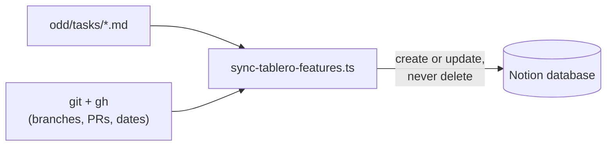

<h1 align="center">Notion Feature Board</h1>

<p align="center">
  A Notion board that keeps itself up to date from your repository's feature documents.
</p>

<p align="center">
  <a href="https://github.com/AlexMendizabal/Tablero-Automatico-Notion/actions/workflows/ci.yml"></a>
  <a href="LICENSE"></a>
  = 22">
  <a href="CONTRIBUTING.md"></a>
</p>

<p align="center">
  <strong>English</strong> · <a href="README.es.md">Español</a>
</p>

<p align="center"></p>

Syncs the status of a repository's features (ODD documents in
`odd/tasks/*.md`) into a Notion database, so you get a board that is always
up to date without maintaining it by hand.

> **Note on naming:** the project was written in Spanish. The Notion property
> names, status values and document keywords (`Estado`, `Terminada`, `ramas`,
> `## Tareas`, ...) are identifiers the script requires, so they are kept in
> Spanish in this README too. English translations are given in parentheses
> where useful.

## How it works

1. **Markdown documents.** Each feature lives in `odd/tasks/<slug>.md`, with
   its task list as checkboxes and the patterns of the branches it uses.
2. **Sync.** The script reads every document, asks `git` and `gh` for
   branches, pull requests and dates, and computes one row per feature
   (status, progress, next pending task, days without activity).
3. **Notion board.** Each row is created or updated in the Notion database;
   nothing is ever deleted.



## What it does and why

Each `odd/tasks/<slug>.md` document describes a feature: its task list, its
branches and (optionally) its associated commits. The script reads all those
documents, computes one row per feature and syncs it (create or update, never
delete) against a Notion database.

Core ideas:

- **One row per feature, never by hand.** Status, progress, the next pending
  task, open PRs, live branches and days without activity are computed from
  the documents and from GitHub (`git` and `gh`). Those fields are not edited
  directly in Notion: the next run overwrites them.
- **Status is derived, never typed.** There is no column where someone writes
  "In progress" or "Done": it comes from the checked tasks and from whether
  there are open PRs, and nothing else (see
  [How the status is derived](#how-the-status-is-derived)).
- **The stalled view.** With "Días sin actividad" (days without activity) as
  a sortable column, the Notion database can be filtered or sorted to show
  first the features that have gone the longest without movement. Without
  that number, those features stay hidden among the rest.
- **Never deletes.** A Notion page whose slug no longer has a matching
  document is reported as an "orphan" in the output, but it is not removed:
  deleting is a human decision.

## Requirements

- Node.js 22 or later.
- `git`, with a full clone of the repository (`fetch-depth: 0` in CI): a
  shallow clone lacks the commit dates and the complete remote branches this
  script needs.
- The [`gh`](https://cli.github.com/) CLI, authenticated (`gh auth login`):
  the script reads the repository's pull requests with `gh pr list`, not
  through the GitHub API directly.

## Installation

```bash
npm ci
```

## Create the Notion database

1. Go to <https://www.notion.so/developers> and create an **internal
   integration** for the workspace, with the **read, update and insert
   content** capabilities. Without all three, the script cannot read the
   schema, create pages or update them.
2. Create a new database of type **"Table - full page"**.
3. Add these 11 properties with these **exact names and types**. The names
   are Spanish identifiers the script looks for, so they must be created
   exactly as written (Notion is case- and accent-sensitive; a name that does
   not match is reported as a missing property):

   | Property | Type | Meaning |
   |---|---|---|
   | Feature | Title | Feature title |
   | Slug | Text (rich text) | Document file name |
   | Estado | Select | Status |
   | Progreso | Text (rich text) | Progress |
   | Pendiente | Text (rich text) | Next pending task |
   | PRs abiertos | Text (rich text) | Open PRs |
   | Ramas | Text (rich text) | Branches |
   | Días sin actividad | Number | Days without activity |
   | Actualizado | Date | Last updated |
   | Documento | URL | Link to the document |
   | Huella | Text (rich text) | Fingerprint of the task list |

   If any of these columns is renamed or changes type in Notion, the
   `ESQUEMA_ESPERADO` constant in `src/sync-tablero-features.ts` must be
   updated too. The two sides of the contract live there and in Notion, and
   neither can be discovered from the other automatically.
4. Share the database with the integration: open the database, open the
   `•••` menu in the top-right corner → **Connections** → find and add the
   integration created in step 1. Without this step, every call from the
   script returns a permissions error even if the token is valid.
5. Get the database ID from its URL. When you open the database in the
   browser, the URL looks roughly like this:

   ```
   https://www.notion.so/myworkspace/Tablero-de-features-a1b2c3d4e5f67890a1b2c3d4e5f67890?v=...
   ```

   The ID is the **32 hexadecimal characters** right before the `?` (in the
   example, `a1b2c3d4e5f67890a1b2c3d4e5f67890`). You can also paste the full
   URL as is: `normalizarIdBaseNotion` recognizes it and drops the `?v=...`,
   which identifies the VIEW, not the database. The **"Copy data source ID"**
   option in Notion's menu does **not** work: that ID belongs to a different
   API object (the "data source", a layer Notion added inside each database
   in 2025) and is not what this script expects in `NOTION_TABLERO_DB_ID`.

## Configuration

Copy `.env.example` to `.env` and fill in the two required variables:

```bash
NOTION_TOKEN=secret_...
NOTION_TABLERO_DB_ID=a1b2c3d4e5f67890a1b2c3d4e5f67890
```

Two optional variables, with their default value in parentheses, adapt the
script to a repository with a different layout:

- `TABLERO_CARPETA` (`odd/tasks`): folder where the documents live, relative
  to the repository root.
- `TABLERO_RAMA_BASE` (`main`): base branch used to build the link in each
  row's "Documento" property.

## Usage

**`npm run sync:dry` without credentials** (no `.env`, or an incomplete one):
no network calls are made to Notion, nor to GitHub beyond the `git`/`gh`
calls needed to compute the rows. For each valid document it prints the row
that would be computed (slug, status, progress, open PRs, days without
activity, update date) and ends with `Errores de formato: N` (format errors).
This is the mode used by the pull request validation job: it never prints
Notion counters ("Creadas:", "Actualizaría:", etc.), because those numbers
were not computed.

**`npm run sync:dry` with credentials**: on top of the above, it queries
Notion read-only (schema, existing pages) and shows the full plan — how many
pages it would create, how many it would update, how many would get their
body rewritten, and which would be orphaned — without writing anything yet.

**`npm run sync`**: runs the real sync against Notion. It exits with a
non-zero code if any document had a format error or any slug is duplicated
in Notion, even if the rest of the features synced without problems.

## Automation

> In this template repository the workflow is **disabled**, so it does not
> show up red without credentials. When adopting it, enable it in the
> Actions tab after adding the two secrets.

The `.github/workflows/sync-tablero-notion.yml` workflow runs on four
triggers:

1. **`push`** to the base branch, when something relevant changes (a
   document in `odd/tasks/`, the script itself, the workflow, or
   `package.json`/`package-lock.json`): performs the real sync.
2. **`pull_request`** on those same paths: only validates the documents'
   format (`sync:dry`, without credentials), so a PR fails before merge if a
   document is malformed.
3. **`schedule`** (daily cron): a push alone is not enough to keep the board
   current, because "Días sin actividad" changes with the mere passage of
   time and merging a PR does not always touch a document. Without this daily
   run, the board freezes between edits.
4. **`workflow_dispatch`**: to force a manual run.

It needs two secrets configured in the repository (**Settings → Secrets and
variables → Actions**): `NOTION_TOKEN` and `NOTION_TABLERO_DB_ID`. If they
are missing, the sync job stops within seconds with an explicit error, before
installing anything, and never reports a success that did not actually write
anything.

Separately, the `.github/workflows/ci.yml` workflow runs `npm run typecheck`
and `npm test` on every push to `main` and every pull request. It needs no
credentials.

## Document format contract

Each document lives at `<TABLERO_CARPETA>/<slug>.md` and has this minimal
shape:

```markdown
---
ramas: ["docs/odd-<slug>", "feat/<slug>*"]
---

# Human-readable feature title

## Tareas

- [ ] **T1 — Short name**: description.
- [ ] **QA1 — Manual test**: description.
```

Rules:

- **`ramas`** (branches; required, in the frontmatter): JSON array of glob
  patterns (only `*` as wildcard) that must cover every branch the feature
  uses. A branch that matches no pattern does not count towards "Ramas",
  "PRs abiertos" or the activity date.
- **`commits`** (optional): JSON array of **full** commit hashes (40
  lowercase hexadecimal characters) made directly on the base branch, with no
  PR or branch of their own. They act as activity anchors for that kind of
  work, which would otherwise have no associated date. Requires a full clone
  of the repository (without `fetch-depth: 0` it is reported as an
  environment error).
- **A single `## Tareas` (tasks) section**: any other level-2 heading closes
  the section. Having zero, or more than one, `## Tareas` section is a format
  error.
- **IDs `T1`, `T2`, ... for work, `QA1`, `QA2`, ... for manual tests**: the
  `QA` prefix is the only thing that distinguishes a task from a manual test
  when deriving the status. The ID goes in bold at the start of the checkbox,
  separated from the name by an em dash (`—`, not a regular hyphen); the
  description after the colon is optional.
- **Code blocks are ignored**: a ` ```markdown ` block containing an example
  frontmatter or `## Tareas` section does not count as the document's real
  frontmatter or section.

A complete example, with one task done, one pending and one pending manual
test, lives in [`odd/tasks/ejemplo-feature.md`](odd/tasks/ejemplo-feature.md).

## How the status is derived

The `Estado` (status) value is one of four, in this order of precedence:

1. **Terminada** (done): there is at least one task, all of them are checked
   as done, and there is no open PR on the feature's branches.
2. **QA pendiente** (QA pending): there are unfinished tasks, and all of them
   are QA tasks (`QA` prefix).
3. **Sin empezar** (not started): no task is checked as done.
4. **En curso** (in progress): any other combination (for example, with tasks
   done and non-QA tasks pending, or with everything done but a PR still
   open).

The "Actualizado" (last updated) date — and from it "Días sin actividad" —
takes the most recent of: the commit of each live branch matching the
patterns, the moment each related PR was merged or closed (or opened, if it
is still open), and the date of each anchor commit declared in `commits`.
Without any of those, it falls back to the date of the document itself and,
if that does not exist either, to the date of the run.

**GitHub's `updatedAt` for a pull request is never used.** That field moves
with events that are not real work on the feature — for example, cleaning up
an old branch updates a PR merged weeks earlier — and using it would hide
genuinely stalled features behind a recent date that means nothing.

## Known limitations

- It only sees what reached GitHub: a local commit that was not pushed, or a
  branch that only lives on one machine, are invisible to this script.
- A failure halfway through rewriting a page body can leave duplicated tasks
  until the next run, which detects the mismatch (through the "Huella"
  property) and repairs the whole page.
- Orphan rows (Notion pages whose slug no longer has a document) are reported
  in the output, but never deleted automatically.

## Contributing

Issues and pull requests are welcome, in English or Spanish. See
[`CONTRIBUTING.md`](CONTRIBUTING.md) for setup, tests and the pull request
flow. To report a security issue, see [`SECURITY.md`](SECURITY.md). Released
changes are listed in [`CHANGELOG.md`](CHANGELOG.md).

## License

MIT. See [`LICENSE`](LICENSE).
